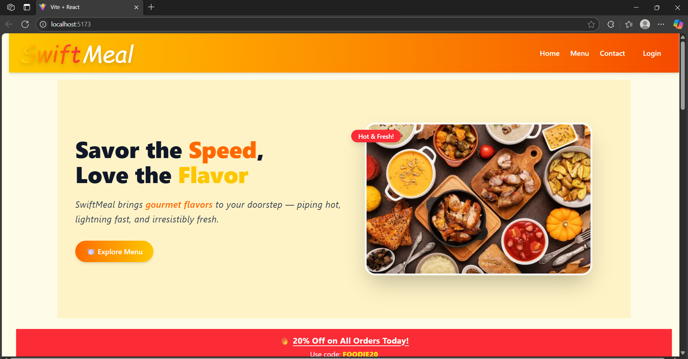
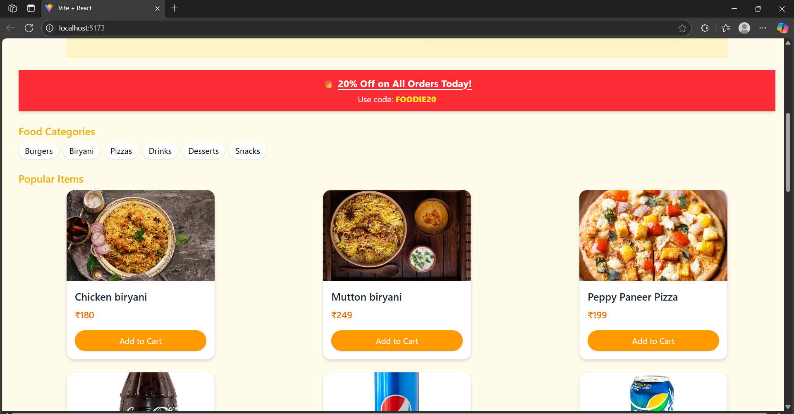
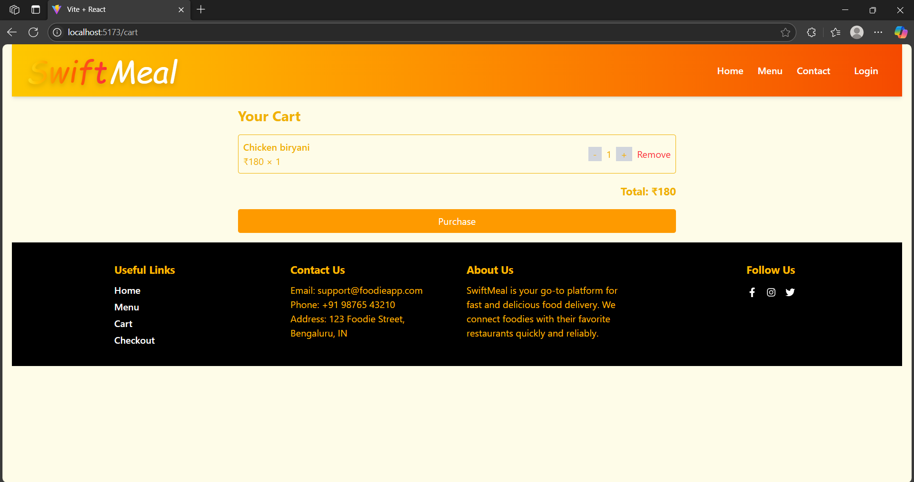
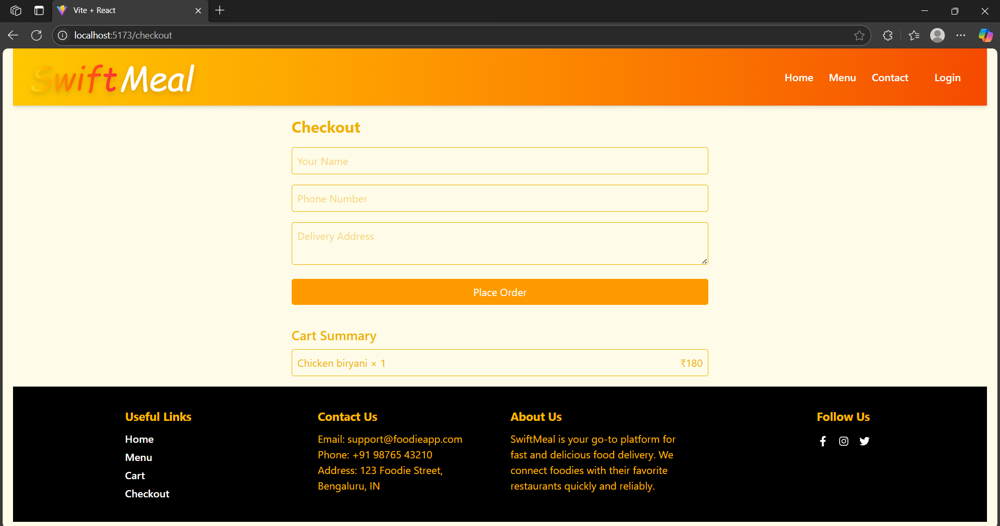
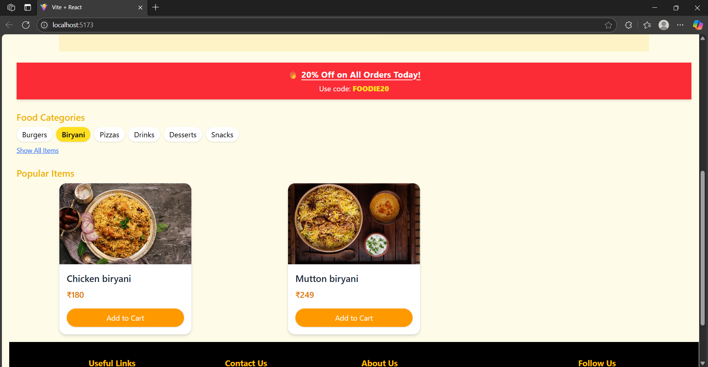

# 🍔 SwiftMeal – Food Delivery Web App

SwiftMeal is a modern and responsive food delivery web app built with React, Vite, and Tailwind CSS. It features a smooth UI, reusable components, and essential pages for browsing, ordering, and checking out food items.

---

## 🚀 Features

- ⚡ Built with **React + Vite** for lightning-fast performance
- 🎨 Styled with **Tailwind CSS** for easy customization
- 🧩 Reusable components (Navbar, Hero, Menu Card, Footer)
- 🛒 Cart functionality with **React Context API**
- ✅ Separate pages: Home, Menu, Cart, Checkout, Login
- 📱 Responsive design for mobile and desktop

---
## 📁 Folder Structure

SwiftMeal/
├── public/
│ └── assets/ # Static images
├── src/
│ ├── components/ # Reusable UI components
│ ├── context/ # CartContext using React Context API
│ ├── pages/ # Pages like Home, Menu, Cart, Checkout
│ ├── styles/ # Global CSS and Tailwind config
│ ├── App.jsx # Main app component
│ ├── main.jsx # Entry point
│ └── index.css # Tailwind and custom styles
├── tailwind.config.js # Tailwind CSS config
├── vite.config.js # Vite config
├── package.json
└── README.md


---

## 🛠️ Installation & Setup

### 1. Clone the Repository

```bash
git clone https://github.com/your-username/swiftmeal.git
cd swiftmeal


2. Install Dependencies
npm install

3. Start Development Server
npm run dev

Then open your browser at http://localhost:5173

📦 Build for Production

npm run build

📸 Screenshots
## 📸 Screenshots

### 🏠 Home Page


### 🍽️ Menu Page


### 🛒 Cart Page


### ✅ Checkout Page


### 📂 Categories Page



🙌 Acknowledgements
1-React
2-Vite
3-Tailwind CSS
4-Google Fonts